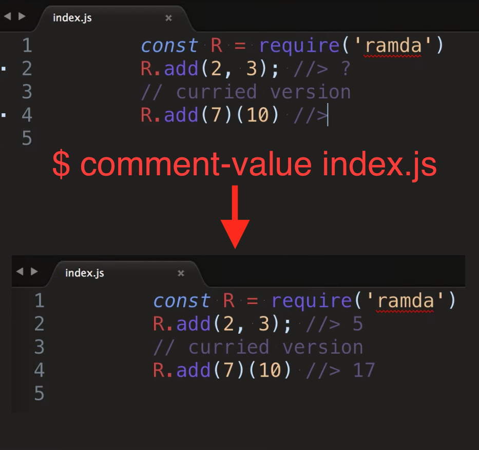

# comment-value

> Instruments a Node program and updates its comments with computed expression values

[![NPM][npm-icon] ][npm-url]

[![Build status][ci-image] ][ci-url]
[![semantic-release][semantic-image] ][semantic-url]
[![js-standard-style][standard-image]][standard-url]

## Why?

Writing and maintaining code examples is hard. Often the values shown in
the comments (think blog posts) are out of date and incorrect.

## What does comment-value do?

`comment-value` or `values` for short executes your Node program,
instrumenting it on the fly. Every time it sees a special comment that
starts with `//>`, it will set it value from whatever the expression
immediately to its left is.

When Node finishes, the file is saved back with updated comments.

[](https://comment-values-awgxclhogn.now.sh/comment-values.webm)

Click on the above screen shot to see 15 second demo clip.

## Watch mode

Automatically (well, as long as `chokidar` works) reruns and updates comments
in the source file. See the
[video](https://glebbahmutov.com/comment-value/comment-value-watch-mode.webm),
it is awesome!

## Install and use

Install `comment-value` either as a global or as a local package.

```
npm install -g comment-value
```

Use either using `node -r comment-value index.js` or via CLI alias:
`comment-value`, `values` or `cv` like this `values index.js`.

Alias `values` is the preferred way. It allows

* Watch files for changes and rerun with `-w, --watch` option
* Print instrumented file with `-i, --instrumented` option

## Example

Add a few comments that start with `//>` to `index.js`. You can put anything
after that into the comment.

```js
// index.js
const add = (a, b) => a + b
add(2, 3) //>
add(2, -3) //> ? anything here
// you can also print variables!
const t = typeof add
// t:
```

Run the `comment-value` script which runs your Node

```sh
$ comment-value index.js
```

The `index.js` will now contain

```js
// index.js
const add = (a, b) => a + b
add(2, 3) //> 5
add(2, -3) //> -1
// you can also print variables!
const t = typeof add
// t: "function"
```

## Comment format

You can start special value comments to be updated with strings
`//>`, `//=>`, `//~>`, `// >`, `// =>` and even `// ~>`.

For variables, use line comment with just variable name followed by `:`,
for example

```js
function add(a, b) {
  // a:
  // b:
}
add(10, 2)
```

which will produce

```js
function add(a, b) {
  // a: 10
  // b: 2
}
add(10, 2)
```

## Composed functions

You can even get results from composed functions, for example, the values
below were all computed automatically

```js
var R = require('ramda')
R.compose(
  Math.abs,     //=> 7
  R.add(1),     //=> -7
  R.multiply(2) //=> -8
)(-4) //=> 7
```

## Console log statements

If the value comment is on the left of `console.log(value)` expression,
then it will be updated with the `value`.

```js
// index.js
console.log(2 + 40) //> ?
```

```sh
$ comment-value index.js
42
```

```js
// index.js
console.log(2 + 40) //> 42
```

## Debug

To see verbose messages while this module runs, set the environment
variable `DEBUG` before running

```
DEBUG=comment-value node ...
```

The instrumenting function has a global emitter, you can receive messages
when special comments are found and when an expression is wrapped.
For example this code will produce the following events

```js
// index.js
console.log(2 + 40) //> ??
// spec.js
let emitter
beforeEach(() => {
  emitter = global.instrument
})
it('finds the comment', () => {
  const comments = []
  const wrapped = []
  emitter.on('comment', c => comments.push(c))
  emitter.on('wrap', w => wrapped.push(w))
  instrument(source)
  // comments will be ["> ??"]
  // wrapped will be ["2 + 40"]
})
```

This is an internal feature and is used during unit tests.

### Small print

Author: Gleb Bahmutov &lt;gleb.bahmutov@gmail.com&gt; &copy; 2017

* [@bahmutov](https://twitter.com/bahmutov)
* [glebbahmutov.com](http://glebbahmutov.com)
* [blog](http://glebbahmutov.com/blog)

License: MIT - do anything with the code, but don't blame me if it does not work.

Support: if you find any problems with this module, email / tweet /
[open issue](https://github.com/bahmutov/comment-value/issues) on Github

## MIT License

Copyright (c) 2017 Gleb Bahmutov &lt;gleb.bahmutov@gmail.com&gt;

Permission is hereby granted, free of charge, to any person
obtaining a copy of this software and associated documentation
files (the "Software"), to deal in the Software without
restriction, including without limitation the rights to use,
copy, modify, merge, publish, distribute, sublicense, and/or sell
copies of the Software, and to permit persons to whom the
Software is furnished to do so, subject to the following
conditions:

The above copyright notice and this permission notice shall be
included in all copies or substantial portions of the Software.

THE SOFTWARE IS PROVIDED "AS IS", WITHOUT WARRANTY OF ANY KIND,
EXPRESS OR IMPLIED, INCLUDING BUT NOT LIMITED TO THE WARRANTIES
OF MERCHANTABILITY, FITNESS FOR A PARTICULAR PURPOSE AND
NONINFRINGEMENT. IN NO EVENT SHALL THE AUTHORS OR COPYRIGHT
HOLDERS BE LIABLE FOR ANY CLAIM, DAMAGES OR OTHER LIABILITY,
WHETHER IN AN ACTION OF CONTRACT, TORT OR OTHERWISE, ARISING
FROM, OUT OF OR IN CONNECTION WITH THE SOFTWARE OR THE USE OR
OTHER DEALINGS IN THE SOFTWARE.

[npm-icon]: https://nodei.co/npm/comment-value.svg?downloads=true
[npm-url]: https://npmjs.org/package/comment-value
[ci-image]: https://travis-ci.org/bahmutov/comment-value.svg?branch=master
[ci-url]: https://travis-ci.org/bahmutov/comment-value
[semantic-image]: https://img.shields.io/badge/%20%20%F0%9F%93%A6%F0%9F%9A%80-semantic--release-e10079.svg
[semantic-url]: https://github.com/semantic-release/semantic-release
[standard-image]: https://img.shields.io/badge/code%20style-standard-brightgreen.svg
[standard-url]: http://standardjs.com/
